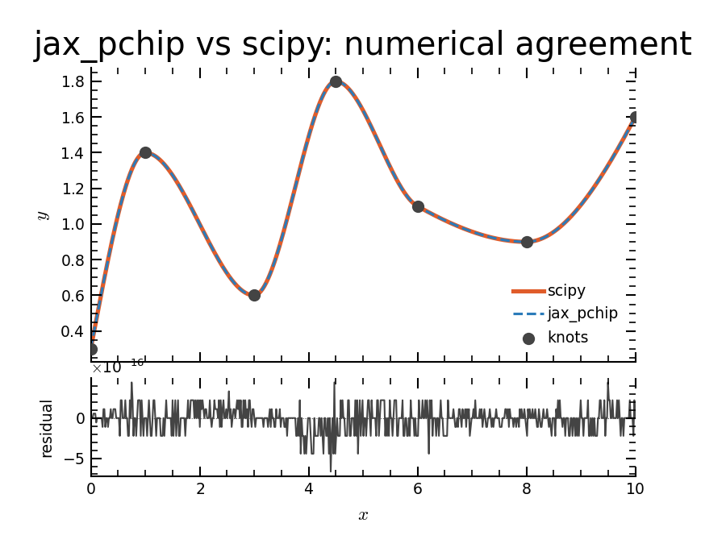
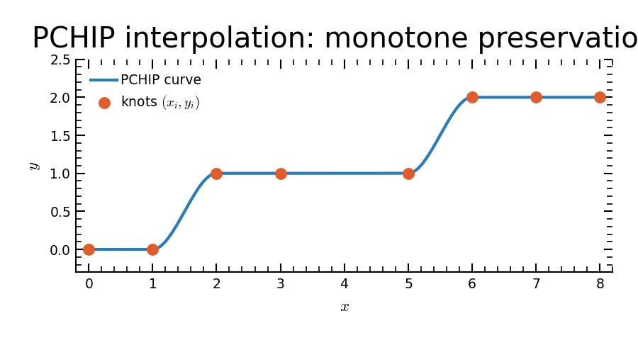

jax_pchip
=========

**scipy's** ``PchipInterpolator`` **, translated to JAX.**

This is just a translation of the scipy implementation to JAX in the same style
as the `jax_cosmo <https://github.com/DifferentiableUniverseInitiative/jax_cosmo>`_
implementation of B-splines.  It is the same Fritsch-Carlson (1980) PCHIP used
by scipy, re-expressed so that knot *heights* are JAX arrays that can be
differentiated and JIT-compiled.

Results match ``scipy.interpolate.PchipInterpolator`` to floating-point precision
(rtol ≈ 1e-6) — the residuals in the figure below are at machine epsilon.

The key design: knot *positions* ``x`` are fixed at construction time (static);
knot *heights* ``y`` are JAX-traced dynamic arrays.  This lets the interpolator
compile once and run at XLA speed for any ``y``.  The figure below shows the
monotone-preserving behaviour inherited from PCHIP: the curve passes cleanly
through flat plateaus without overshoot.

Quick start
-----------

.. code-block:: python

   import jax
   import jax.numpy as jnp
   from jax_pchip import PchipInterpolator

   jax.config.update("jax_enable_x64", True)

   x_knots = jnp.array([0.0, 1.0, 3.0, 6.0, 10.0])
   interp  = PchipInterpolator(x_knots)          # x is static

   y = jnp.array([0.5, 1.2, 0.8, 1.5, 1.0])
   x_query = jnp.linspace(0, 10, 200)

   values = jax.jit(interp)(y, x_query)                              # JIT-compiled
   g      = jax.grad(lambda y: interp(y, x_query).sum())(y)         # gradient w.r.t. y
   batch  = jax.vmap(lambda y: interp(y, x_query))(y[None] * jnp.ones((10, 5)))  # vmap

Installation
------------

.. code-block:: bash

   pip install jax-pchip

or from source:

.. code-block:: bash

   git clone https://github.com/pjs902/jax_pchip
   pip install -e ".[test]"

.. toctree::
   :maxdepth: 1

   api
